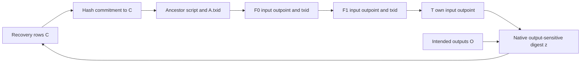

# R14: staged SegWit publication does not defer an authenticated recovery table

Date: 2026-09-17. Question: can mandatory funding stages place a literal native
ECDSA recovery table after its rows become known but before funding, avoiding
the full funding-outpoint dependency through P2WSH or nested P2SH-P2WSH?

**No acyclic construction was found in this family.** SegWit permits late
publication of witness bytes without changing that transaction's txid. It
does not let a descendant inherit an authenticated table from those witness
bytes. An existing P2WSH commitment authenticating the publication belongs to
the spent ancestor. Its txid then enters every subsequent mandatory outpoint.
Nested P2SH adds another commitment in the descendant's scriptSig.

The scoped conclusion is about finite staging using existing hash wrappers
and output-sensitive native ECDSA checks. It is not a lower bound on arbitrary
Script computation or on algorithms for solving the resulting hash equations.
No optional verifier input, key erasure, or unbound witness table is proposed
as a successful construction.

Artifacts: [Python](r14_table_chronology.py), [JSON](r14_table_chronology.json).
Evidence `locally-reproduced`, deployment `unclassified`: exact host
transaction serialization, BIP143 preimages, and actual secp256k1 equations.
The first ancestor spends a synthetic outpoint. No Core, funded consensus
validation, repository library change, or field test is claimed.

## Concrete candidate: publish the rows while spending an earlier output

Let C be the public table object and let an ancestor A authenticate it with

```
W_C = SHA256 <SHA256(C)> EQUAL
v0  = 00 20 SHA256(W_C).
```

A's output is either v0 directly or P2SH(v0). The mandatory next transaction
F spends that very output and supplies `[C, W_C]` as its witness. Its output
funds the later native checker T. This is one chain of mandatory inputs, not
an optional additional checker input.

In the native case F has empty scriptSig. In the nested case its scriptSig
must be exactly the 35-byte push of v0. The witness is omitted from F's txid,
but A's serialized output already contains either SHA256(W_C) or its P2SH
wrapper. Changing C changes A's txid and thus F's input outpoint. In the
nested case it also changes F's required scriptSig. These are the exact
[BIP141 commitment and serialization rules](https://github.com/bitcoin/bips/blob/24e96e870fffaa257b465ce1f0370c14aac588e8/bip-0141.mediawiki#specification),
not an assumption that witness bytes themselves appear in txids.

The executable serializes both variants with 1, 2, 4, and 8 intermediate
transactions. In all eight configurations, changing the committed rows changes
every ancestor/funding txid along the chain and changes T's native BIP143
digest, while the intended output vector and final checker remain fixed.
All byte strings and ids are recorded, including the nested redeem-program
push and the 35-byte ancestor witnessScript.

This ancestor hash guard only authenticates the published bytes. It is not
silently granted a native interpretation as T's rows. Connecting that object
to T's actual keys would still require an enforceable descendant check.
If T's locking script directly contains the table or its hash, the original
R11 immediate funding dependency reappears. If the proposal instead promises
to retrieve the ancestor witness, that retrieval/authentication mechanism
must be supplied; P2WSH nesting does not provide it.

## The exact construction dependency graph

For two intermediate stages, the dependency is:



This is a **construction-dependency cycle**, not a cyclic Bitcoin transaction
graph. The serialized transaction chain itself is an ordinary directed
acyclic chain. More stages insert more vertices without removing an edge.

The specific recovery rows satisfy

```
P_i = (s R_i - z G) / r.
```

With fixed nonzero r, fixed s and fixed R_i, changing z changes each key
injectively modulo n. Therefore these literal rows cannot simply ignore a
new actual digest. Choosing different signature or root parameters in
response would be an additional simultaneous-equation search, not the
claimed acyclic staging algorithm.

**Scoped structural statement.** Suppose a finite construction authenticates
literal rows solely through P2SH/P2WSH hashes in an ancestor of the output
eventually spent by T, and constructs those rows from an output-sensitive
native digest of T. Then moving that commitment to an earlier mandatory
stage cannot by itself give a topological generation order. The commitment
reaches T's own outpoint through the ancestor txid chain, while that outpoint
is an input to the digest used to construct the rows. This statement assumes
the ordinary binding interpretation of these hashes; it is not a proof
excluding collisions, special fixed points, or a different row-construction
algorithm.

## Why witness publication alone gives a different result

An explicit diagnostic weakens the ancestor program to `DROP TRUE` so that
it publishes, but does not commit to, one 131-byte row object. This is
deliberately a rejected candidate, included to isolate the missing edge.
The serialization has a fixed-width public layout: alpha32 || P1_33 ||
P2_33 || P3_33. Only the host assembles this payload; no free Script
concatenation or parsing is assumed.

Two F witnesses carrying different rows have exactly the same txid:

```
578e25bc3e073c43bf6b7ee50487d88d36ab16f16b8d642f0c4e50cff523d5f0.
```

Their wtxids differ. Even if the chain recorded F with the intended rows,
the descendant T still references only that shared txid and output index.
The existing native signature hash gives it no authenticated copy of F's
witness table.

The diagnostic descendant is a real 51-byte fixed P2WSH checker. It pins the
actual 32-byte alpha, executes CODESEPARATOR, and verifies alpha under three
actual supplied compressed keys. Rows recovered for the intended output
vector pass. Different rows recovered for a single 989000-sat output to a
different recipient also pass **while spending exactly the same F**. There
are six actual public ECDSA verifications and two complete successful host
stack replays. The signature bytes are the same in both cases; the keys
differ. This is the missing ancestor-to-descendant binding, not a failure of
the R9 theorem for three already authenticated common keys.

The table is consequently not saved by the fact that F's witness is publicly
visible or that its block commits to a wtxid. An existing descendant Script
check would need an authenticated way to use that specific earlier witness.
This artifact supplies none and does not count such access as free.

## Signature modes and CODESEPARATOR do not remove this edge

BIP143 serializes the current input's 36-byte outpoint unconditionally,
separately from hashPrevouts. The executable checks the six conventional
flags 01, 02, 03, 81, 82 and 83: in every preimage the own-outpoint field
occupies bytes 68..103, and changing it changes the digest. ANYONECANPAY
zeros the aggregate hashPrevouts; it does not remove this explicit field.
Exact preimages are included. See the pinned
[Core signature-hash implementation](https://github.com/bitcoin/bitcoin/blob/49faec4f87f5cd19c88db01a82e5c68b087c8227/src/script/interpreter.cpp#L1495-L1534)
and [BIP143](https://github.com/bitcoin/bips/blob/24e96e870fffaa257b465ce1f0370c14aac588e8/bip-0143.mediawiki#specification).

The native checker grants the strongest useful CODESEPARATOR arrangement:
the actual scriptCode is the fixed 11-byte signature-check suffix, excluding
the literal alpha pin. The own-outpoint field still remains. NONE sacrifices
output binding, and SINGLE does not remove this field. The exceptional legacy
out-of-range SINGLE result also loses output binding; it was already analyzed
in earlier rounds and is not re-run or counted as a solution here.

Checking a predecessor transaction natively instead would check that
predecessor's transaction context. It does not evaluate the later T digest.
Putting T's asserted digest into predecessor witness data does not change
which transaction CHECKSIG hashes. The same missing native-reference
authentication must still be resolved.

## Measurements and what would escape this statement

The diagnostic publisher has a 2-byte script, 1 initial argument, 0 hints,
2 complete witness items and 136 serialized witness bytes. Its combined
stack peak is 1. The committed ancestor has a 35-byte witnessScript,
1 argument, 0 hints, 2 complete witness items, 169 serialized witness bytes
and peak 2. The 131-byte object fits one ordinary stack element.

The descendant has **51 script bytes, 14 executed non-push operations,
4 initial data items, 0 hints, 5 complete witness items, 188 serialized
witness bytes, combined stack peak 6**. Both actual-key sets coexist at entry
only within their own invocation; no batched hidden hint collection is used.
Its intended and changed-output transactions measure respectively 303 bytes /
642 weight units and 272 bytes / 518 weight units. These are raw host boundary
measurements, not optimized primitive metrics or consensus validation.

Setup for these failed examples is O(number of stages) transaction hashes
and a constant number of public recovery operations. Increasing the stage
count has not solved the cyclic construction, so this cheap diagnostic work
is not an honest covenant setup bound below 2^64.

A mechanism outside the scoped statement would need to supply one of the
following concrete missing capabilities:

* A fixed program that **computes and authenticates** the intended reference
  rows from the actual native context, without first embedding those rows or
  their hashes in its ancestors. This is the unresolved evaluator route.
* An output-binding signature mode that omits its own funding outpoint.
  Existing conventional ECDSA modes tested here do not provide that mode.
* An authenticated descendant-readable commitment to the chosen ancestor
  witness that avoids the same construction dependency. Existing hash
  wrappers alone do not provide such access.
* A fully charged algorithm solving the simultaneous commitment/recovery
  equations below the required work bound, instead of claiming an acyclic
  construction. No general lower bound rules that possibility out here.

Public audit of the complete intended spend can verify a proposed solution
to all these equations before broadcasting funding. That audit does not
supply missing rows or turn an uncommitted publication into a native
descendant constraint. No retained signing key is treated as unavailable.

Reproduce with:

```
python3 research/covenant-2026-09-17/continuation/r14_table_chronology.py
```
